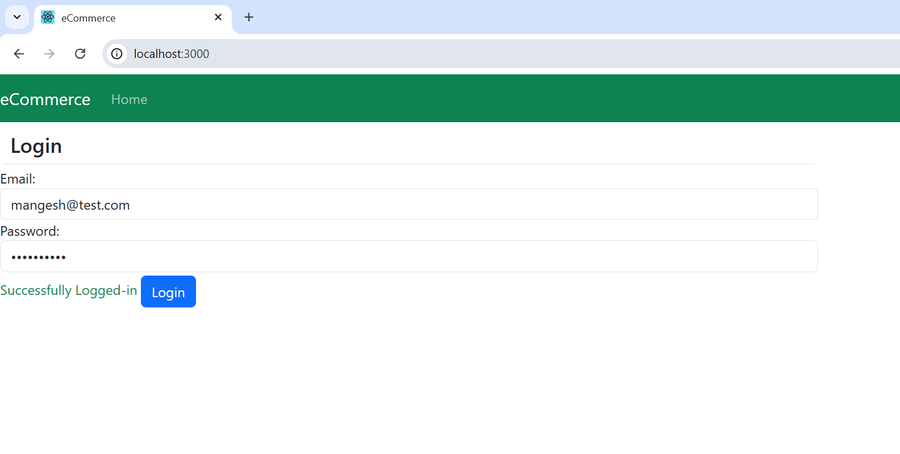

# React Login Form with Two-Way Binding and Validation

This project demonstrates how to implement two-way binding in a React login form, showcasing the use of form elements, state management, event handling, and basic validation.

## Features

- **Login Form**: Includes email and password fields.
- **State Management**: Demonstrates how to bind form input values to component state and update state based on input changes.
- **Event Handling**: Utilizes `onChange` event handlers to achieve two-way binding and allows for additional logic execution.
- **Validation**: Checks user credentials and displays feedback messages.

## Getting Started

### Prerequisites

- Node.js
- npm (Node Package Manager)

### Installation

1. **Clone the repository**:

   Navigate to the project directory:

   Install dependencies:
   npm install
   Running the Application
   Start the development server:
   npm start
   Open your browser and navigate to http://localhost:3000.
   Project Structure
   src/: Contains the source code.
   App.jsx: Main application component.
   Login.jsx: Login form component.
   Implementation Details
   One-Way Binding
   React supports one-way binding by default, where the state updates the form elements. For example, updating the state with setState will reflect the changes in the text box.

   ```

   ```

Two-Way Binding
React does not support two-way binding out of the box. To achieve two-way binding:

Bind State to Input: Use the value attribute to bind the state to the input field.
Update State on Input Change: Use the onChange event handler to update the state based on the input field's value.
Example
In the Login.jsx file:

Add onChange event handlers to the email and password input fields.
Use an arrow function or a separate method to update the state with the latest input values.
<input
type="text"
className="form-control"
value={this.state.email}
onChange={(event) => this.setState({ email: event.target.value })}
/>
<input
type="password"
className="form-control"
value={this.state.password}
onChange={(event) => this.setState({ password: event.target.value })}
/>
Handling Additional Logic
If you need to perform additional logic in the onChange event, you can create a separate method in the component:

handleEmailChange = (event) => {
this.setState({ email: event.target.value });
// Additional logic, e.g., making an HTTP request
};

<input
  type="text"
  className="form-control"
  value={this.state.email}
  onChange={this.handleEmailChange}
/>
Form Submit Button
To validate the login credentials and display feedback messages:

Update the state with the latest input values in the onChange event handlers.
Check the credentials in the onLoginClick method.
Update the message state to display success or error messages.
onLoginClick = () => {
const { email, password } = this.state;
if (email === 'mangesh@test.com' && password === 'mangesh123') {
this.setState({ message: <span className="text-success">Successfully Logged-in</span> });
} else {
this.setState({ message: <span className="text-danger">Invalid login, please try again</span> });
}
};

// Render the message near the button
render() {
return (

<div className="col-lg-9">
<h4 className="m-1 p-2 border-bottom">Login</h4>
<div className="form-group form-row">
<label className="col-lg-4">Email:</label>
<input
type="text"
className="form-control"
value={this.state.email}
onChange={(event) => this.setState({ email: event.target.value })}
/>
</div>
<div className="form-group form-row">
<label className="col-lg-4">Password:</label>
<input
type="password"
className="form-control"
value={this.state.password}
onChange={(event) => this.setState({ password: event.target.value })}
/>
</div>
<div className="text-right">
{this.state.message}
<button className="btn btn-primary m-1" onClick={this.onLoginClick}>
Login
</button>
</div>
</div>
);
}
Output Screenshot
Successful Login
!Successful Login

Invalid Login
!Invalid Login

Future Improvements
Add form validation.
Enhance styling and responsiveness.
Implement additional features like "Remember Me" checkbox and "Forgot Password" link.
License
This project is licensed under the MIT License.

Author
Developed by Mangesh Hagare.
